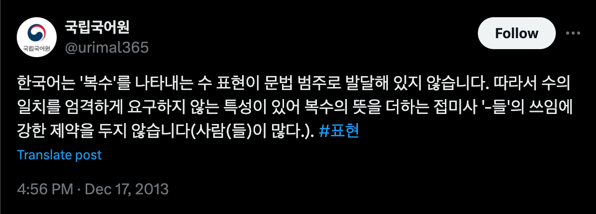

# 추상(Abstract)

# 2.4 이름 짓기


명료한 글을 작성하기 위해서는 표현이 중요하다. 코드도 마찬가지다. 이름은 읽는 사람에게 의도를 전달한다.
단, 이름을 잘 지어야 한다.

개발자는 매일 이름을 짓는다. 재밌게도, 작명가보다 이름을 많이 짓는다. 변수, 상수, 함수, 클래스... 셀 수 없다.

> 이름 짓는 시간을 단축할 수 있다면 생산성이 올라가지 않을까?

## 도메인 지식

도메인 지식은 직업에 관계없이 중요하다. 그렇다면, 개발자에게 도메인 지식은 왜 중요할까?
앞서 추상화를 배웠다. 추상적 사고, 추상화를 잘하기 위해서는 도메인 지식이 필요하다.

회사의 비즈니스를 모르면 어떻게 용어를 추상화할 수 있을지 생각해 봤다. 예를 들어 '영화 예매 시스템'을 만들어보자.

```java 
public interface Product {
    // 비즈니스... 
}

public interface Ticket {
    // 비즈니스
}
```

"영화관에서 파는 물건은 상품이야."

영화산업을 알지 못하면 티켓을 상품이라 표현할 수 있다. 처음에는 큰 문제가 되지 않는다. 하지만 잘못된 추상화로 비즈니스가 확장된다면 어떨까.
상품의 의미는 판매하는 티켓일까 혹은 음식일까? 지류티켓일까, 스마트 티켓일까? VIP 상품이 자연스러울까?

물류 시스템을 만들 때 상품이라는 표현을 사용해서 문제를 해결했더라도, 도메인에 따라 다르게 이해할 수 있다. 따라서 도메인 지식이 중요하다고 생각한다.

**도메인 지식을 추상화해서 만들어낸 구현체가 코드다.**

## 실용적인 팁

### 단수와 복수를 구분하기



영어를 잘 알지 않아도 단수는 비교적 간단하다. 하지만 문제는 복수다. 한국어는 단수. 복수를 표현할 때 `들`이라는 표현을 사용한다.
하지만 이마저도 익숙하지 않다. 그런데 영어로 복수를 어떻게 표현할까?

`-(e)s`를 붙일 수 있다. 하지만 영단어는 여러 상황에 따라 다르게 사용한다. 예를들어 다음과 같다.

- cat -> cats
- city -> cities
- leaf -> leaves

머리가 아프다. 도메인 용어를 이해했는데 복수의 벽을 만났다. ~~복수한다.~~
또 다른 방법은 `List`를 사용한다.

```java
public class MovieTheater {
    private Ticket ticket;

    // 티켓 여러장을 표현하는 방법
    private List<Ticket> tickets;
    private List<Ticket> ticketList;
}
```

- 이름 줄이지 않기
- 은어, 방언 사용하지 않기
- 좋은 코드를 보고 습득하기

## 2.5 메서드와 추상화

메서드의 추상화는 앞서 배운 변수를 통한 추상화와 유사하다. 메서드를 이야기하기 앞서, 잘 쓰인 글은 명료하게 작성되어 주제가 보인다.
코드도 그렇다. 메서드에는 가능한 하나의 동작을 기술하는 방법이 좋다. 이는 추후 테스트를 작성할 때 빛을 발휘한다.
뿐만 아니라 코드를 이해할 때도 여러 개의 동작을 이해해야 한다면 인지비용이 증가한다.

만약 추상화가 어렵다면 메서드가 많은 책임을 지고 있는 건 아닌지 생각해 보자.
메서드의 역할을 생각하고 책임을 분산하는 방법이 당신을 이롭게 한다.
